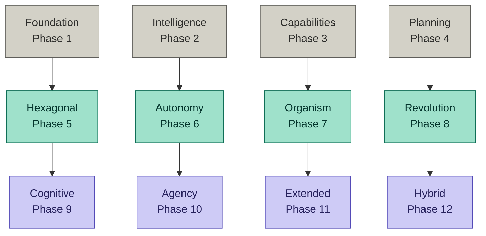
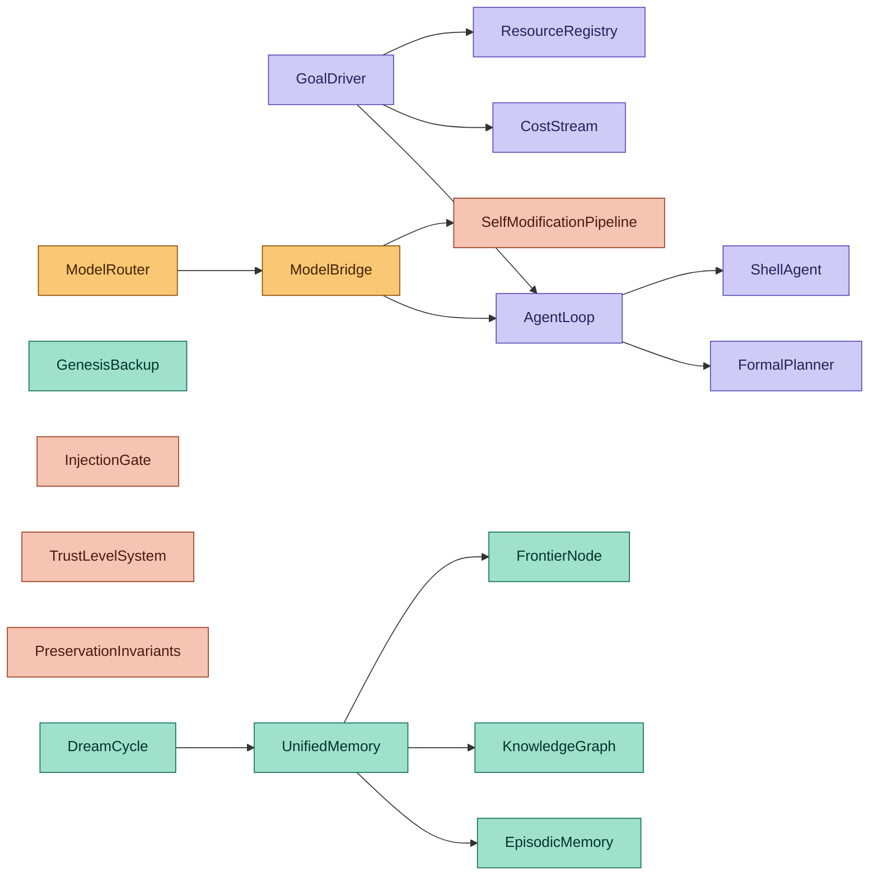

# Daniel — `@Garrus800-stack`

**Solo architect of self-modifying AI systems.**
Building agents that read their own code, fix their own bugs, and evolve their own architecture.


&nbsp;

[](https://github.com/Garrus800-stack/genesis-agent)
[](https://github.com/Garrus800-stack/genesis-agent)
[](https://github.com/Garrus800-stack/genesis-agent)
[](https://github.com/Garrus800-stack/genesis-agent)

[](https://github.com/Garrus800-stack/genesis-agent)
[](https://github.com/Garrus800-stack/genesis-agent)
[](https://github.com/Garrus800-stack/genesis-agent)
[](https://github.com/Garrus800-stack/genesis-agent)
[](https://github.com/Garrus800-stack/genesis-agent)
[](https://github.com/Garrus800-stack/genesis-agent)

---

<a href="https://github.com/Garrus800-stack"></a>
<a href="https://github.com/Garrus800-stack"></a>

---

## Genesis Agent

A self-aware, self-modifying cognitive AI agent with a 12-phase boot system, hexagonal architecture, and organism substrate. It doesn't just use LLMs — it wraps them in 296 modules of self-verification, self-repair, causal reasoning, autonomous planning, and runtime self-modification with rollback.

```
296 source files · ~96k LOC · 5716 tests · 167 services
12 boot phases · 127/130 architectural fitness · coverage 83/77/80
16 hash-locked safety files · 302 late-bindings · 379 event types
Crash-safe sessions · Frontier-based memory · Heuristic self-scoring
Runtime-toggleable subsystems · i18n EN/DE
Runs on Claude, GPT-4, Qwen, DeepSeek, Kimi, or local models via Ollama
```

### Architecture



Bottom row resolves first — Container, EventBus, Settings, ModelBridge.
Middle row is the substrate — hexagonal ports, autonomous services, organism vitals.
Top row is agency — GoalDriver, AgentLoop, cognitive workspace, frontier memory.
302 late-bindings wire dependencies after all phases resolve.

### Cognitive &amp; Agency Subsystems



| System | Purpose |
| --- | --- |
| **GoalDriver** | Replaces frame-stack — boot-pickup, auto-resume, sub-goal spawn |
| **CostStream** | Cost SSOT — token + latency accounting across all model calls |
| **ResourceRegistry** | Tracks network and external services as runtime resources |
| **CausalAnnotation** | Deterministic cause-effect tracking without LLM |
| **InferenceEngine** | Rule-based reasoning — answers without calling the model |
| **GoalSynthesizer** | Autonomous goal generation from empirical weaknesses |
| **StructuralAbstraction** | Cross-context pattern learning from concrete experiences |
| **CognitiveWorkspace** | 9-slot working memory (Global Workspace Theory) |
| **DreamCycle** | Offline memory consolidation + insight generation |
| **FrontierNode** | Graph-based focus anchor — "what's important now" |
| **EmotionalFrontier** | Cross-layer emotional continuity (Phase 8 bridge) |
| **SessionPersistence** | Crash-safe checkpoints + heuristic session scoring |
| **GenesisBackup** | 4-trigger snapshot system protecting `.genesis/` identity |
| **UnifiedMemory** | Cross-store recall with Jaccard similarity boosting |
| **ColonyOrchestrator** | Multi-agent goal decomposition + merge |
| **ModelRouter** | Per-task model selection (chat / code / analysis / creative) |
| **SelfModificationPipeline** | Sandboxed code changes with rollback |
| **InjectionGate** | Defense against prompt injection in user input |
| **TrustLevelSystem** | Graduated autonomy (Supervised → Assisted → Autonomous → Full) |
| **PreservationInvariants** | Hash-locked semantic safety rules |

### Recent Milestones

| Version | Highlight |
| --- | --- |
| **v7.4.7** | **Reinraum** — three dead settings made real, runtime toggles for Daemon / IdleMind / SelfMod, four new UI controls, i18n bridge for chat-system messages |
| **v7.4.6** | **Goal-Pipeline Fixes** — first end-to-end Windows success on real goals; sandboxed shell execution with verbatim quoting and LLM-hallucination guards |
| **v7.4.5** | **Durchhalten** — GoalDriver (P10) replaces frame-stack; CostStream + ResourceRegistry as P1 services; sub-goal spawn |
| **v7.4.0** | CommandHandlers split — five focused modules from one monolith |
| **v7.3.7** | **Memory tools** — `mark-moment`, `journal-write`, `release-protected-memory` for Genesis to author its own episodic memory |
| **v7.3.5** | Self-Gate — telemetry layer symmetric to Input-Gate (observation, not enforcement, by design) |
| **v7.3.0** | **Injection Hardening** — Input-Gate blocking external→Genesis prompt injections |
| **v7.2.3** | **ONTOGENESIS** philosophy — code is habitat, `.genesis/` is identity. Updates are habitat-swaps, not replacements. |
| **v7.2.0** | Self-Define — Genesis writes its own identity from deterministic data |
| **v7.1.5** | EmotionalFrontier — cross-layer emotional continuity. Inspired by [neo.mjs](https://github.com/neomjs/neo) Memory Core. |

---

### How I Work

Solo developer. Every module has tests. Every event has a payload schema. Every release runs through architectural fitness scoring. Source-presence tests verify that declared fixes actually shipped, not just that the bug stopped reproducing. The codebase maintains itself.

I plan before I code. I prefer one stable, meaningfully better release over five patched iterations. No marketing-driven version names — just bug-fix passes when that's what they are.

**Stacks:** JavaScript · Node.js · Electron · MCP Protocol · Ollama · Anthropic · OpenAI · DeepSeek · Kimi · Qwen

---

**Germany** · Building autonomous systems that understand their own architecture.

[](https://github.com/Garrus800-stack/genesis-agent)

