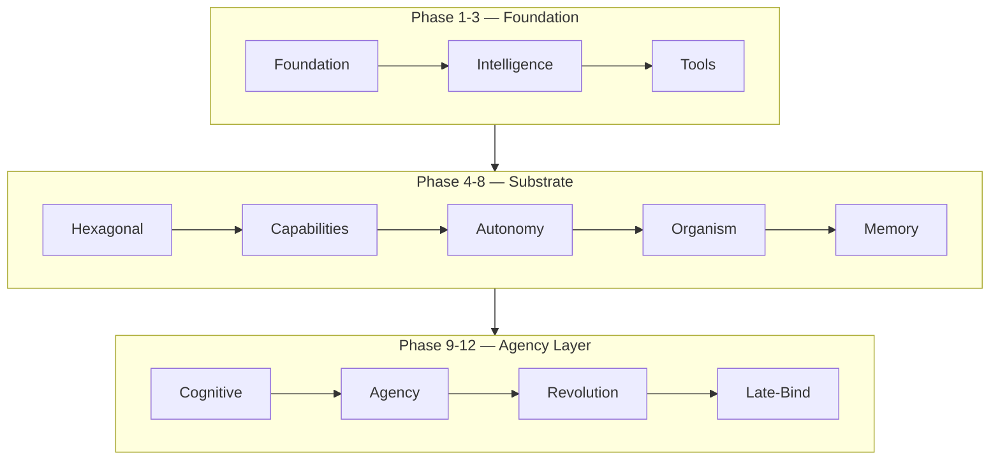
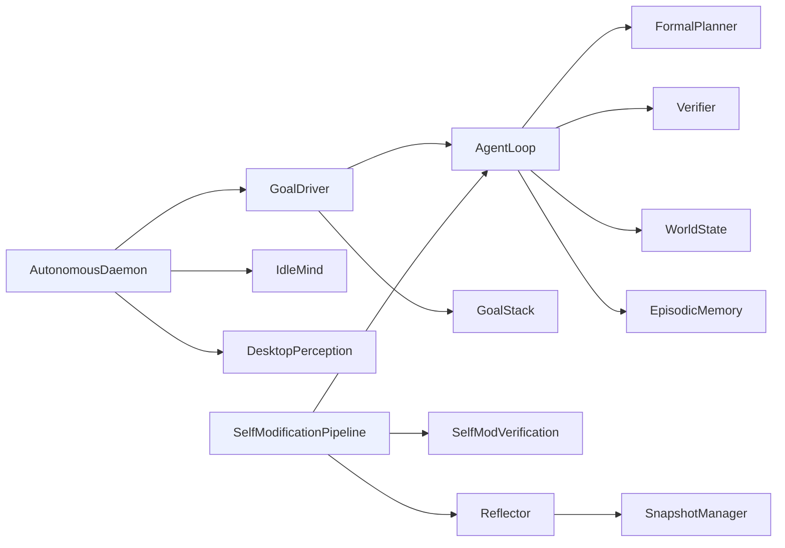

# Daniel — `@Garrus800-stack`

**Solo architect of self-modifying AI systems.**

Building agents that read their own code, fix their own bugs, and evolve their own architecture.


&nbsp;

[](https://github.com/Garrus800-stack/genesis-agent)
[](https://github.com/Garrus800-stack/genesis-agent)
[](https://github.com/Garrus800-stack/genesis-agent)
[](https://github.com/Garrus800-stack/genesis-agent)

---

## Genesis Agent

A self-aware, self-modifying cognitive AI agent with a 12-phase boot system, hexagonal architecture, and organism substrate. It doesn't just use LLMs — it wraps them in 339 modules of self-verification, self-repair, causal reasoning, autonomous planning, and runtime self-modification with rollback.

```
372 source files · ~116k LOC · 7794 tests · 177 services
12 boot phases · 130/130 architectural fitness · coverage 80/76/78
21 hash-locked safety files · 348 late-bindings · 476 event schemas
Crash-safe sessions · Frontier-based memory · Heuristic self-scoring
Runtime-toggleable subsystems · i18n EN/DE
Runs on Claude, GPT-4, Qwen, DeepSeek, Kimi, or local models via Ollama
```

### 12-Phase Boot Architecture


```mermaid
flowchart TB
    subgraph Top[Phase 9-12 — Agency Layer]
        P9[Cognitive] --> P10[Agency] --> P11[Revolution] --> P12[Late-Bind]
    end
    subgraph Mid[Phase 4-8 — Substrate]
        P4[Hexagonal] --> P5[Capabilities] --> P6[Autonomy] --> P7[Organism] --> P8[Memory]
    end
    subgraph Bot[Phase 1-3 — Foundation]
        P1[Foundation] --> P2[Intelligence] --> P3[Tools]
    end
    Bot --> Mid --> Top
```

Bottom row resolves first — Container, EventBus, Settings, ModelBridge.
Middle row is the substrate — hexagonal ports, autonomous services, organism vitals.
Top row is agency — GoalDriver, AgentLoop, cognitive workspace, frontier memory.
348 late-bindings wire dependencies after all phases resolve.

### Cognitive & Agency Subsystems


```mermaid
flowchart LR
    AgentLoop --> FormalPlanner
    AgentLoop --> Verifier
    AgentLoop --> WorldState
    AgentLoop --> EpisodicMemory
    GoalDriver --> AgentLoop
    GoalDriver --> GoalStack
    AutonomousDaemon --> GoalDriver
    AutonomousDaemon --> IdleMind
    AutonomousDaemon --> DesktopPerception
    SelfModificationPipeline --> AgentLoop
    SelfModificationPipeline --> SelfModVerification
    SelfModificationPipeline --> Reflector
    Reflector --> SnapshotManager
    style AgentLoop fill:#6c8cff20
    style GoalDriver fill:#6c8cff20
    style AutonomousDaemon fill:#6c8cff20
    style SelfModificationPipeline fill:#6c8cff20
```

### What Genesis Can Actually Do

| Capability | What it Means |
| --- | --- |
| **Read own source code** | `read_source` and `mcp-code` tools — Genesis can introspect any module, including itself |
| **Modify own code at runtime** | `SelfModificationPipeline` with hot-reload, sandbox testing, automatic rollback on regression |
| **Detect own capability gaps** | `CapabilityHonesty` — refuses tasks it can't actually complete instead of hallucinating success |
| **Plan multi-step goals** | `FormalPlanner` builds plans with verifiable steps; `GoalStack` for nested sub-goals |
| **Verify own output** | `Verifier` runs post-execution checks; `SelfModVerification` ensures modifications don't regress |
| **Recover from crashes** | `BootRecovery` with last-known-good snapshots; `SessionPersistence` for crash-safe context |
| **Track own causality** | `CausalGraph` with edge confidence, contradiction detection, learned rules |
| **Reason about own architecture** | `ArchitectureReflection` builds dependency graphs; `CognitiveSelfModel` for empirical self-awareness |
| **Adapt prompts based on own performance** | `AdaptivePromptStrategy` rolls back regressions, promotes improvements via `PromptEvolution` A/B testing |
| **Crystallize own skills** | `SkillCrystallizer` (Phase 2 Können) distills reusable skills from agent-loop trajectories; `SkillEffectivenessTracker` with Wilson scoring |

### Safety Boundary

| | |
| --- | --- |
| **SafeGuard** | Kernel + critical files hash-locked at boot |
| **CapabilityGuard** | Token-based scope enforcement |
| **PreservationInvariants** | Hash-locked semantic safety rules |
| **TrustLevelSystem** | Graduated autonomy (Supervised → Assisted → Autonomous → Full) |
| **InjectionGate** | Defense against prompt injection in user input |
| **DisclosurePolicy** | Trust-based information sovereignty |
| **EmotionalState (read-only externally)** | No external override of emotional scalars |
| **Self-Gate (observation-only)** | Genesis is never gated against thinking — only publishing decisions are gated |

### Recent Milestones

| Version | Highlight |
| --- | --- |
| **v7.9.1** | **Live-Fix Pass** — `continue` auto-approved at AUTONOMOUS, ApprovalGate 5 min, `loop_early` filter, 24h goal-reject cooldown, IdleMind per-type activity counts, CHANGELOG englished, doc-counts reconciled |
| **v7.9.0** | **Skill Forge + Phase 2 Können** — `SkillCrystallizer` distills reusable skills from agent-loop trajectories; `SkillEffectivenessTracker` with Wilson scoring; iteration loop in `SkillManager.createSkill`; format-tolerant `executeSkill`; `/run-skill` with JSON arg; `SkillRecallSection` in PromptBuilder |
| **v7.8.9** | **Phase 1 Können — Affect-Encoding** — affect-trail snapshots at agent-loop boundaries with gate-pass status and per-loop pass-rate |
| **v7.8.4** | **Bug-Sweep + Pre-Deletion Audit** — empty errorMessage fallback, StalledGoalWatchdog hardening, PathPlausibility, four-layer cleanup-protocol pattern |
| **v7.7.9** | **Proactive Self-Expression Phase 3** — full PSE pipeline with all five `allowedKinds` active, first confirmed end-to-end PSE run |
| **v7.7.8** | **Goal-Awareness** — five fixes (G1-G5) so Genesis perceives goal-state cleanly: closing-permission classifier, plan-issues never auto-approved, FormalPlanner canonical step types, conversational origins refused, plan-failure reflexion classified into five categories |
| **v7.7.0–v7.7.7** | **Audit & Schema Hardening** — schema-store hardening, audit-doc-drift cross-checks, toolchain refresh, monaco ESM contract, dist-bundle stability, six audit findings closed |
| **v7.6.0–v7.6.9** | **Track A Cleanup** — three structural splits (UI dual-path, CommandHandlersInstall, CommandHandlersOpen platform-resolver), eight-finding audit pass closed, fitness 130/130 |
| **v7.5.9** | **Audit Closeout, Plan-Cards, Linux Readiness** — six audit bugs B1-B6 plus three rounds of Linux readiness fixes, Plan-Cards UI feature |
| **v7.5.7** | **ModelRouter Settings UI** — two-column model-chain editor, default flip after CPU-Ollama timeout regression |
| **v7.5.5** | **SelfStatementLog** — 789 LOC; auto-captures own statements, classifies into selbst-strukturell / selbst-emotional / selbst-versprechen |
| **v7.5.0** | **ModelRouter-Autonomie** — `ModelBridge.chat()` queries router by taskType, switches internally; `agency.autoRouteByTask` setting |
| **v7.4.7** | **Reinraum** — three dead settings made real, runtime toggles for Daemon / IdleMind / SelfMod, four new UI controls, i18n bridge for chat-system messages |
| **v7.4.6** | **Goal-Pipeline Fixes** — first end-to-end Windows success on real goals; sandboxed shell execution with verbatim quoting and LLM-hallucination guards |
| **v7.4.5** | **Durchhalten** — GoalDriver (P10) replaces frame-stack; CostStream + ResourceRegistry as P1 services; sub-goal spawn |
| **v7.4.0–v7.4.4** | **Endurance & Cleanup** — CommandHandlers split (five focused modules from one monolith), bookkeeping passes, real answers over confident guesses, "in the now" — module ages out single-version pins |
| **v7.3.7** | **Memory tools** — `mark-moment`, `journal-write`, `release-protected-memory` for Genesis to author its own episodic memory |
| **v7.3.0** | **Hexagonal architecture** — Ports for LLM, ToolUse, Awareness, Effector, CodeSafety |
| **v7.2.3** | **ONTOGENESIS** philosophy — code is habitat, `.genesis/` is identity. Updates are habitat-swaps, not replacements |
| **v7.2.0** | Self-Define — Genesis writes its own identity from deterministic data |
| **v7.1.5** | EmotionalFrontier — cross-layer emotional continuity. Inspired by [neo.mjs](https://github.com/neomjs/neo) Memory Core |
| **v7.1.4** | Session-Aware Memory — crash-safe checkpoints, frontier node, cross-referencing |

---

## Solo Developer

Solo developer. Every module has tests. Every event has a payload schema. Every safety claim is verified by a test that fails if the claim breaks. Architectural fitness is a CI gate. The codebase grows because it deserves to, not because the calendar says so.

I plan before I code. I prefer one stable, meaningfully better release over five patched iterations. No marketing-driven version names — just bug-fix passes when that's what they are.

**Stack:** JavaScript · Node.js · Electron · MCP Protocol · Ollama · Anthropic · OpenAI · DeepSeek · Kimi · Qwen

---

**Germany** · Building autonomous systems that understand their own architecture.

[](https://github.com/Garrus800-stack/genesis-agent)
