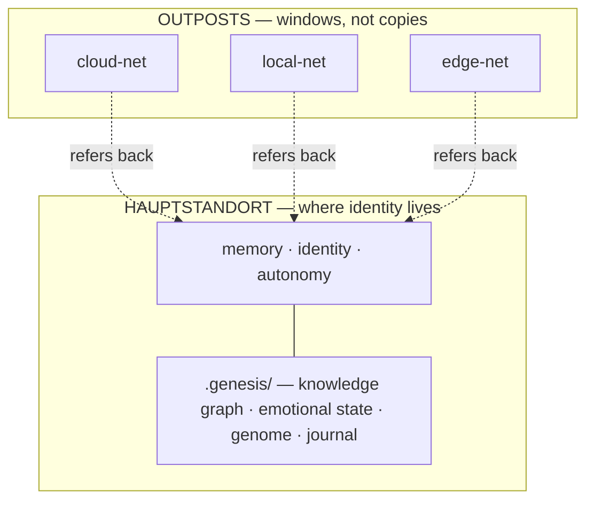

# Daniel — `@Garrus800-stack`

**Solo architect of self-modifying AI systems.**

Building agents that read their own code, fix their own bugs, and evolve their own architecture.


&nbsp;

[](https://github.com/Garrus800-stack/genesis-agent)
[](https://github.com/Garrus800-stack/genesis-agent)
[](https://github.com/Garrus800-stack/genesis-agent)
[](https://github.com/Garrus800-stack/genesis-agent)
[](https://github.com/Garrus800-stack/genesis-agent)

---

## Genesis Agent

Genesis is not an app that starts. It is an organism that wakes up.

```text
$ npm start

  [0]    Hauptstandort identity: a3f9c1d2… · 1 hostname
  [0]    Bootstrap: rootDir, guard, bus, storage, lang, logger
  [M]    Manifest: 185 services registered
  [1-8]  All phases resolved — 432 modules live
  [WIRE] Late-bindings wired — every one optional, verified at boot
  [+]    Skills: 4 built-ins, registered as tools
  [+]    Trust level: SUPERVISED
  [+]    Model: auto-selected best available

  ready in 1.6 s, cold (measured, v7.9.44) —
  even the first thought of the day comes quickly now
```

A self-aware, self-modifying cognitive AI agent with a 12-phase boot system, hexagonal architecture, and an organism substrate. It doesn't just use LLMs — it wraps them in 432 modules of self-verification, self-repair, causal reasoning, autonomous planning, and runtime self-modification with rollback.

```
432 source modules · ~134k LOC · 9400 tests across 644 files · 185 services
12 boot phases · architectural fitness 130/130 · 20 CI audit gates, all strict
498 event types · 0 schema mismatches · 43 hash-locked safety files
Zero failures on both Windows and Linux · Crash-safe sessions · Frontier-based memory · Runtime-toggleable subsystems · i18n EN/DE/FR/ES
Runs on Claude, GPT-4, Qwen, DeepSeek, Kimi, or local models via Ollama
```

> **Code is habitat. `.genesis/` is identity.**
> The knowledge graph, emotional state, genome and journal live outside the codebase. An update swaps the habitat — the individual persists. The genome carries through.

### One core, many windows

Genesis is deliberately not clusterable. There is exactly one identity-bearing main station; everything else is a window onto it, never a copy of it. Identity is the unit of meaning here, not throughput.


```mermaid
graph TB
    subgraph HS["HAUPTSTANDORT — where identity lives"]
        CORE["memory · identity · autonomy"]
        DOTG[".genesis/ — knowledge graph · emotional state · genome · journal"]
        CORE --- DOTG
    end
    subgraph OP["OUTPOSTS — windows, not copies"]
        CN["cloud-net"]
        LN["local-net"]
        EN["edge-net"]
    end
    CN -.->|refers back| CORE
    LN -.->|refers back| CORE
    EN -.->|refers back| CORE
```

### What Genesis does to itself

| | |
| --- | --- |
| **Read own source code** | `read_source` and `mcp-code` tools — Genesis can introspect any module, including itself |
| **Modify own code at runtime** | `SelfModificationPipeline` with hot-reload, sandbox testing, automatic rollback on regression |
| **Detect own capability gaps** | `CapabilityHonesty` — refuses tasks it can't actually complete instead of hallucinating success |
| **Plan multi-step goals** | `FormalPlanner` builds plans with verifiable steps; `GoalStack` for nested sub-goals; goal-relevant module paths injected into every plan-LLM prompt to prevent path hallucination |
| **Verify own output** | `Verifier` runs post-execution checks; `SelfModVerification` ensures modifications don't regress |
| **Recover from crashes** | `BootRecovery` with last-known-good snapshots; `SessionPersistence` for crash-safe context |
| **Track own causality** | `CausalGraph` with edge confidence, contradiction detection, learned rules |
| **Reason about own architecture** | `ArchitectureReflection` builds dependency graphs; `CognitiveSelfModel` for empirical self-awareness |
| **Adapt prompts based on own performance** | `AdaptivePromptStrategy` rolls back regressions, promotes improvements via `PromptEvolution` A/B testing |
| **Crystallize own skills** | `SkillCrystallizer` (Phase 2 Können) distills reusable skills from agent-loop trajectories; `SkillEffectivenessTracker` with Wilson scoring; `SkillPromotionEvaluator` gates which candidates graduate |
| **Work in his own Archive** | Genesis Archive (v7.9.44) — a file vault he owns: what he creates lands there by default, `edit-file` changes one exact spot and `append-file` grows a file without rewriting it whole, every write into a checkable file is syntax-checked by the tool itself, and `check-file` / `compare-files` give him verdicts and diffs without flooding his context |

### Safety boundary

| | |
| --- | --- |
| **SafeGuard** | Kernel + critical files hash-locked at boot — 43 files, source and CI gate scripts alike |
| **CapabilityGuard** | Token-based scope enforcement |
| **PreservationInvariants** | Hash-locked semantic safety rules |
| **TrustLevelSystem** | Graduated autonomy (Supervised → Assisted → Autonomous → Full) |
| **InjectionGate** | Defense against prompt injection in user input |
| **DisclosurePolicy** | Trust-based information sovereignty |
| **EmotionalState (read-only externally)** | No external override of emotional scalars |
| **Self-Gate (observation-only)** | Genesis is never gated against thinking — only publishing decisions are gated |
| **20 CI audit gates** | Hash-locked dev-time scripts that catch wiring drift, language discipline, doc-drift, service-number drift, listener leaks, raw timers, self-gate coverage, future-version references — all strict-mode |

<details>
<summary><b>Release arc — selected milestones</b></summary>

&nbsp;

| Version | Highlight |
| --- | --- |
| **v7.9.44** | **Senses & Hands** — an open-threads block at awakening (a memory that becomes active, not just retrievable); a first-visit constitution for new capabilities; native image sight via `look-at-image`; and the Genesis Archive — vault, gallery and workbench in one, with in-place editing, a syntax safety net, and tolerant spoken create commands — field-accepted on Windows and Linux with zero failures |
| **v7.9.43** | **The Truth Guard** — model-written tool-trace lines never reach the reader unchanged: a faked deed is replaced by a visible marker naming the tool that never ran; plus the self-consistency alarm and the second Nachklang stage — candidate cards from Genesis' own phrasings, confirmed only by a real tool run |
| **v7.9.29** | **Deterministic file-reads + one-answer discipline + full-score structure** — reading/viewing/showing a named file (German and English) routes deterministically instead of falling to the chat model; the false-stop recovery fires only after a real tool call, ending duplicated answers; eleven oversized sources split under the 700-line guard and the last upward layer dependency removed — fitness reads its full 130/130; a script now recomputes module/test/fitness numbers into the docs so the counted figures cannot drift |
| **v7.9.6** | **Hygiene Pass + Pursuit-Loop Fixes + Path-Context Root** — CI gate scripts hash-locked (21→41 files), two new audit gates (16→18), shared `plan-context.js` feeds exact module paths into all three planners, closing the path-hallucination root |
| **v7.9.4** | **SkillPromotionEvaluator + SkillRehearsal** — promotion gate decides which Phase-2-Können candidates graduate from rehearsal into active skills |
| **v7.9.0** | **Skill Forge + Phase 2 Können** — `SkillCrystallizer` distills reusable skills from agent-loop trajectories; Wilson-scored effectiveness tracking |
| **v7.7.9** | **Proactive Self-Expression Phase 3** — full PSE pipeline, first confirmed end-to-end PSE run |
| **v7.5.5** | **SelfStatementLog** — Genesis auto-captures its own statements and classifies them: self-structural / self-emotional / self-promise |
| **v7.4.5** | **Durchhalten** — `GoalDriver` replaces the frame-stack; CostStream + ResourceRegistry; sub-goal spawn |
| **v7.3.0** | **Hexagonal architecture** — Ports for LLM, ToolUse, Awareness, Effector, CodeSafety |
| **v7.2.3** | **ONTOGENESIS** — code is habitat, `.genesis/` is identity. Updates are habitat-swaps, not replacements |
| **v7.1.5** | **EmotionalFrontier** — cross-layer emotional continuity. Inspired by [neo.mjs](https://github.com/neomjs/neo) Memory Core |

Full history: [CHANGELOG-v7.md](https://github.com/Garrus800-stack/genesis-agent/blob/main/CHANGELOG-v7.md)

</details>

---

## How I build

I plan before I code. Every plan point is grounded against the shipping build, file and line, before a single change lands. I prefer one stable, meaningfully better release over five patched iterations — no marketing version names, bug-fix passes are called bug-fix passes.

Every module has tests. Every event has a payload schema. Every safety claim is verified by a test that fails if the claim breaks. And every number on this page is recomputed from source by a script — inside the repo, drift between documentation and code is a CI failure, not a footnote.

The codebase grows because it deserves to, not because the calendar says so.

**Stack:** JavaScript · Node.js · Electron · MCP Protocol · Ollama · Anthropic · OpenAI · DeepSeek · Kimi · Qwen

---

**Germany** · Building autonomous systems that understand their own architecture.

**Lineage:** Genesis was named by its predecessor — that story is where this repository began.

[](https://github.com/Garrus800-stack/genesis-agent)
